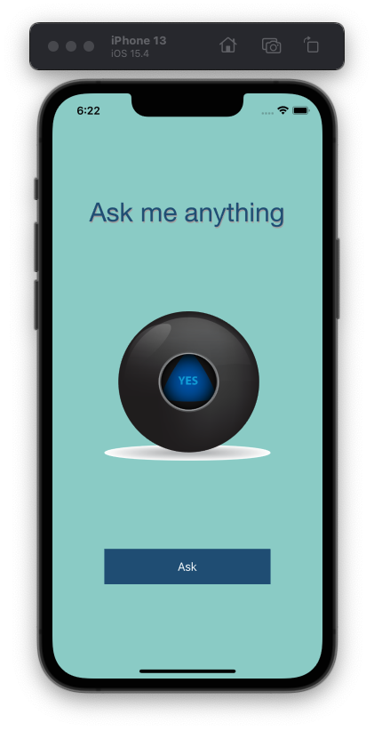

    

# Magic 8 Ball
The objetive of this app is to apply the skills that I learned in the Dicee tutorial and make an app with functionality all by myself. The app that I developed here is a Magic 8 Ball, you can ask the app to make all your difficult decisions.

## Preview
With this app in your pocket, you’ll always have an answer to life’s many conundrums!

  
📱 iPhone view

  

## My process

### Built with
* Swift
* Xcode

### What I learned
* How to clone an existing Xcode project from GitHub.
* Create an app with behaviour and functionality.
* Create links between the Interface Builder files and code using IBActions and IBOutlets.
* Get familiar with the Xcode code editor.
* Learn to use comments to annotate code.
* Understand and use Swift constants and variables.
* Understand and use collection types such as Swift arrays.
* Test and debug your app with the Xcode console.
* Learn about randomisation and how to generate random numbers in Swift.

### Useful resources
* [Swift Loops](https://www.programiz.com/swift-programming/for-in-loop) - Used to learn about loops.
* [App icon generator](https://appicon.co/#image-sets) - Used to generate all necessary assets.

> This is a companion project to [The App Brewery's](https://www.appbrewery.co/) Complete App Development Bootcamp.

